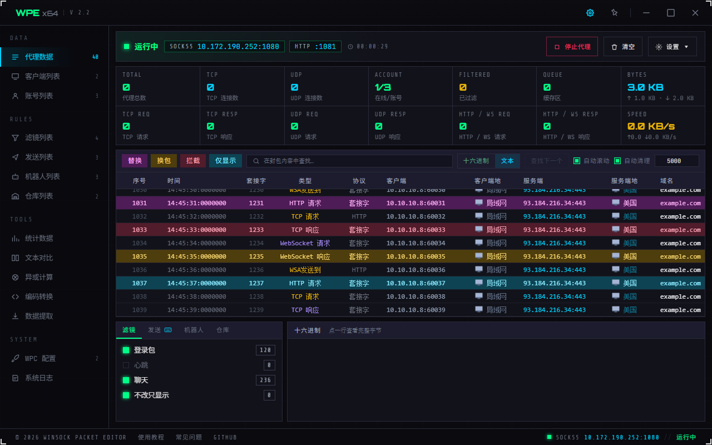
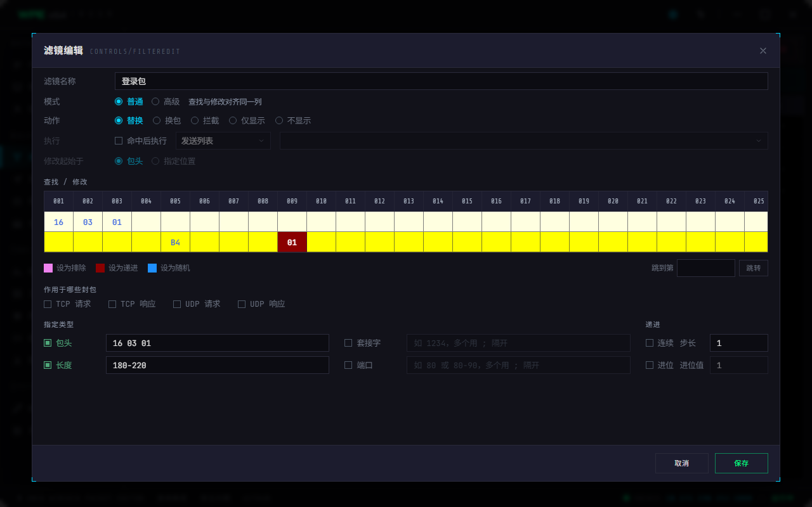
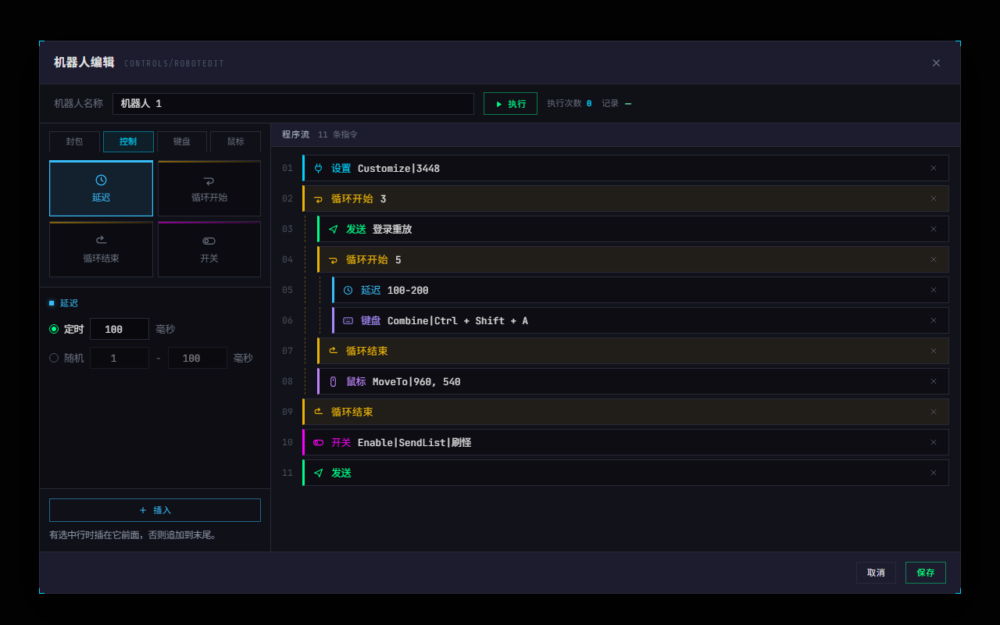
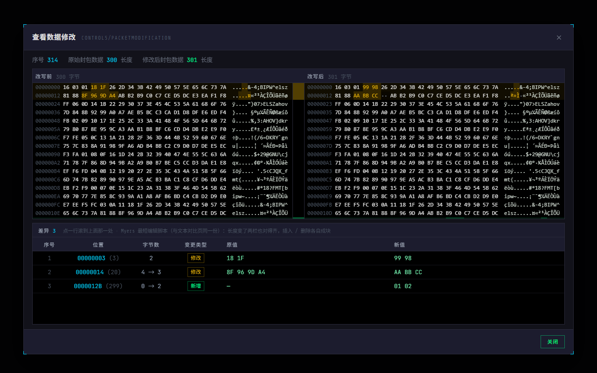
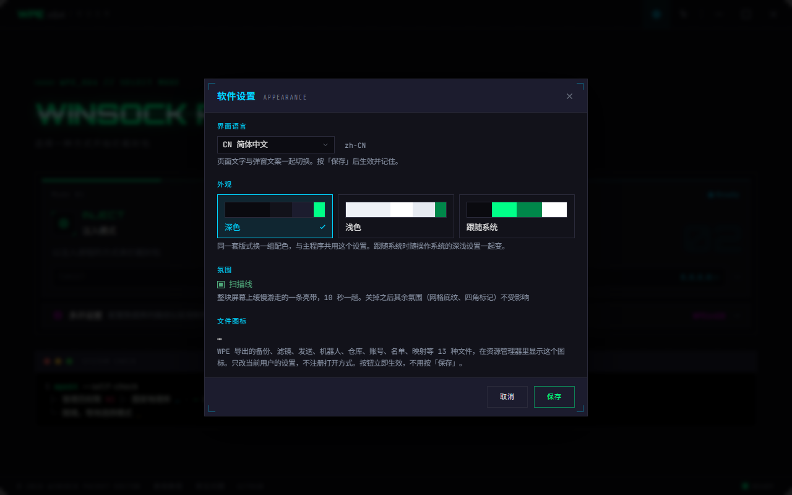
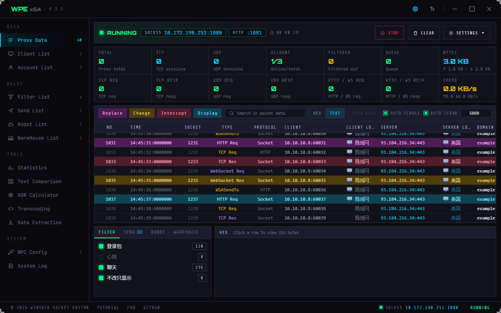
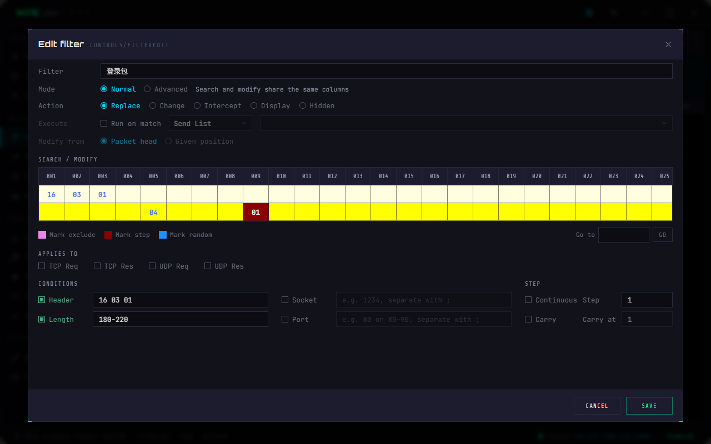
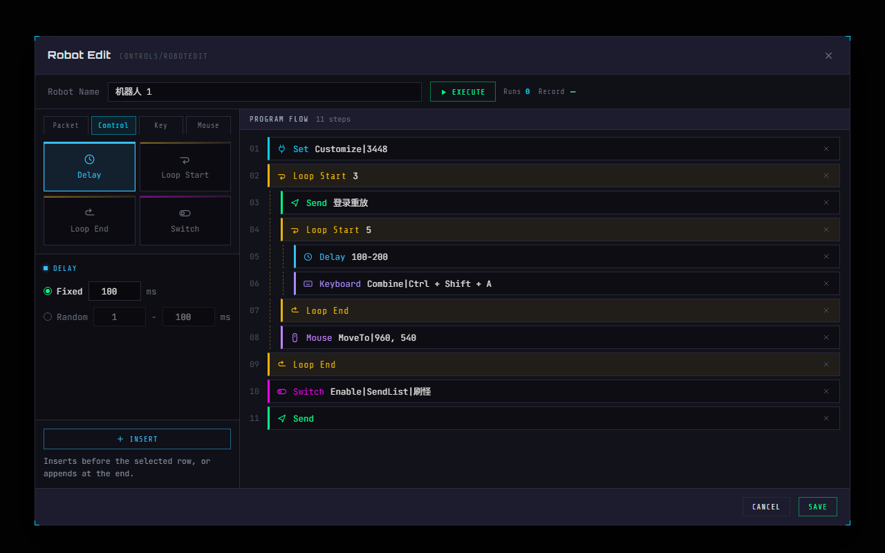
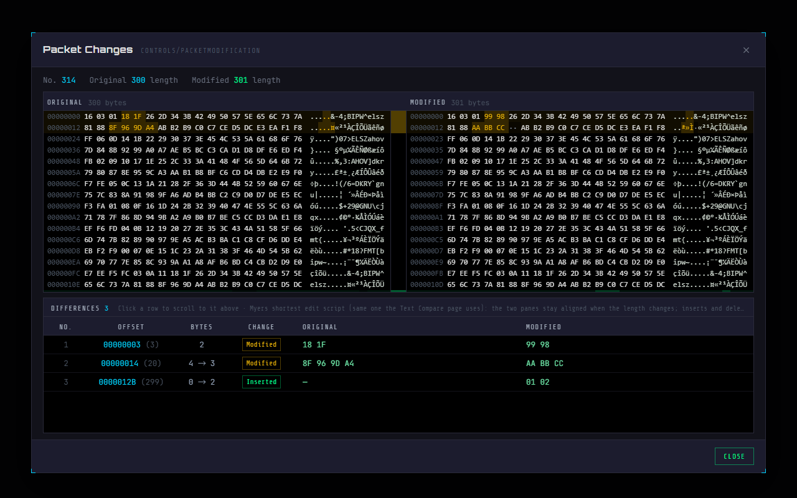
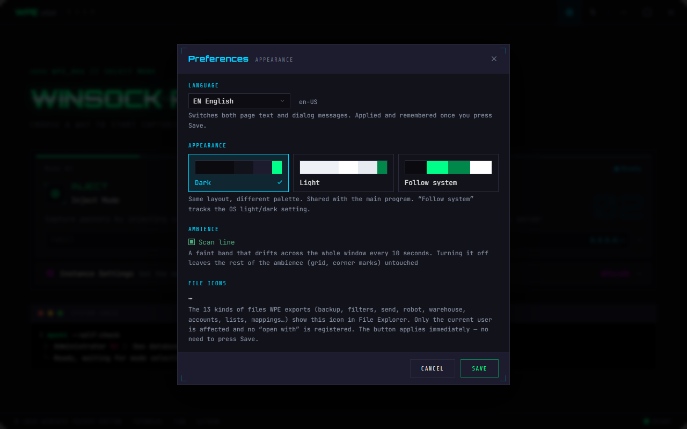

# WPE x64

**看清、改写并重放程序的网络封包**
*See, edit and replay the network packets a program sends and receives*

&nbsp;
&nbsp;
&nbsp;

**[中文说明](#-中文)** · **[English](#-english)** · [官网 Website](https://www.wpe64.com) · [使用教程 Tutorial](https://www.wpe64.com/tutorial.html) · [下载 Download](https://www.wpe64.com/downloads.html)

---

## 🟢 中文

一款 Windows 上的**网络封包拦截与编辑工具**。它能把某个程序收发的每一条网络封包实时列出来，让你**看清里面的内容、改写它、再发一遍**——协议调试、接口审计、协议学习、模拟器与手游分析都用得上。界面是深色赛博风格，支持**七种语言**与**深 / 浅主题**。

 
实时抓包主界面 —— 每一条封包实时进列表，命中规则的行按颜色区分

 

### ✨ 它能做什么

- 📡 **实时抓包**：把目标程序收发的封包一条条列出来，随时暂停、搜索、导出。
- ✏️ **改写封包**：十六进制并排编辑，改完可以立即再发一遍。
- 🎨 **规则自动改**：设好「滤镜」，符合条件的封包自动替换 / 拦截 / 改长度，命中的行按颜色标出来。
- 🤖 **自动化**：用「机器人」把一串动作（发包、延迟、循环、模拟键鼠）排成流程自动跑。
- 🔍 **对比与查找**：并排看改写前后、按字节或按行找不同，列表支持文本 / 十六进制 / 正则搜索。
- 🔒 **看清加密流量**：代理模式下连 **HTTPS** 这类加密内容也能以明文呈现。
- 🌍 **随身即用**：免安装，单个文件双击就能跑，退出时自己收拾干净。

### 🎯 两种工作方式，按场景选

| | 适合 | 说明 |
|---|---|---|
| 🎯 **注入模式** | 单个程序、模拟器、手游 | 附着到目标程序上，从内部把它的封包读出来；对模拟器尤其好用，连启动瞬间的封包都抓得到。 |
| 🌐 **代理模式** | 手机、另一台电脑、要看 HTTPS 明文 | 让程序（或整台设备）把流量经过 WPE 转发，途中就能看到、改写；加密的 HTTPS 也能解开看。 |

### 🧰 主要功能一览

<table>
<tr>
<td width="50%" valign="top">
 
<b>滤镜</b>：设定「符合什么条件、怎么改」，抓到就自动执行。
</td>
<td width="50%" valign="top">
 
<b>机器人</b>：把发包、延迟、循环、键鼠排成一条可视化流程。
</td>
</tr>
<tr>
<td width="50%" valign="top">
 
<b>改写前后对比</b>：并排看原始字节和改写后的字节。
</td>
<td width="50%" valign="top">
 
<b>七种语言 + 深 / 浅主题</b>：随时切换，可跟随系统。
</td>
</tr>
</table>

### 💡 典型用途

- **协议调试**：自己写的客户端 / 服务端对不上时，直接看线上真实的字节，比两端加日志快得多。
- **接口审计**（需已获授权）：构造异常数据检验目标的处理，或核对敏感信息有没有明文外传。
- **协议学习**：拿到一个没有文档的私有协议，靠对照实验一个字段一个字段推出它的结构。
- **模拟器 / 手游分析**：安卓模拟器直接注入；真机把 WPE 当成局域网里的代理接进来。

> ⚠️ 请只在**你自己的软件、测试环境或已获授权的目标**上使用。在带反作弊的网络游戏里使用抓包 / 改包工具可能导致封号。

### ⬇️ 下载与运行

1. 到 **[下载中心](https://www.wpe64.com/downloads.html)** 的 WPE64 标签页下载最新版压缩包 `WPE64 v2.2.zip`（约 61 MB，**免安装**，蓝奏云 / 百度网盘任选）。
2. **解压之前**先在 zip 上右键「属性 → 解除锁定 → 应用」，再解压 —— 里面是 `WPE64 2.2.exe` 和校验文件 `WPE64 2.2.exe.sha256.txt`（核对方法见下载中心）。
3. 双击 `WPE64 2.2.exe`，在权限提示上选「是」即可（需要管理员权限）。首次运行会先释放程序文件。

> ⚠️ **从旧版本升级**：2.2 改动较多，配置按版本分开存放、不会自动继承。升级前请先用旧版的「备份设置」导出全部数据，装好新版再导入。

**系统要求**：Windows 10 / 11（或 Server 2019 / 2022）· 64 位。首次打开若是白屏，是缺少界面运行时，程序会弹出一键安装引导，装完重开即可。

### 🔗 更多

📖 **[完整使用教程](https://www.wpe64.com/tutorial.html)** · ❓ **[常见问题](https://www.wpe64.com/faq.html)** · 🌐 **[官网 www.wpe64.com](https://www.wpe64.com)**

---

## 🟢 English

A **network packet capture-and-edit tool** for Windows. It lists every packet a program sends and receives in real time, so you can **see what's inside, change it, and send it again** — handy for protocol debugging, interface auditing, learning an undocumented protocol, and analyzing emulators and mobile games. The interface is a dark, cyber-styled UI available in **seven languages** with **dark / light themes**.

 
Live capture — every packet streams into the list, and rows matched by a rule are color-coded

 

### ✨ What it does

- 📡 **Live capture** — list every packet the target sends and receives; pause, search and export any time.
- ✏️ **Edit packets** — a side-by-side hex editor; replay a packet the moment you're done.
- 🎨 **Rewrite by rule** — set up a *filter* and matching packets are replaced / blocked / resized automatically, with matched rows color-coded.
- 🤖 **Automation** — a *robot* runs a sequence of steps (send, delay, loop, simulate keyboard and mouse) for you.
- 🔍 **Compare & search** — view before/after side by side, diff by byte or by line; search the list as text, hex or regex.
- 🔒 **See encrypted traffic** — in proxy mode even **HTTPS** shows up in the clear.
- 🌍 **Portable** — no installer; one file, double-click to run, and it cleans up after itself on exit.

### 🎯 Two ways to work, pick per situation

| | Best for | How it works |
|---|---|---|
| 🎯 **Inject Mode** | a single program, emulators, mobile games | Attaches to the target and reads its packets from the inside; great with emulators, and it even catches the packets sent the instant it launches. |
| 🌐 **Proxy Mode** | phones, another PC, seeing HTTPS in the clear | Routes the program's (or a whole device's) traffic through WPE, where you can watch and rewrite it; encrypted HTTPS is decrypted for you. |

### 🧰 Feature tour

<table>
<tr>
<td width="50%" valign="top">
 
<b>Filters</b> — set "match this, change it that way" and it runs automatically on capture.
</td>
<td width="50%" valign="top">
 
<b>Robots</b> — arrange send, delay, loop and key/mouse steps into a visual flow.
</td>
</tr>
<tr>
<td width="50%" valign="top">
 
<b>Before / after</b> — see the original bytes next to the rewritten ones.
</td>
<td width="50%" valign="top">
 
<b>Seven languages + dark / light themes</b> — switch any time, or follow the system.
</td>
</tr>
</table>

### 💡 Typical uses

- **Protocol debugging** — when your own client and server don't agree, read the real bytes on the wire instead of adding logs on both ends.
- **Interface auditing** (with authorization) — feed the target unusual data to test how it copes, or check that nothing sensitive leaves in the clear.
- **Learning a protocol** — take an undocumented private protocol and work out its structure field by field through experiment.
- **Emulator / mobile analysis** — inject an Android emulator directly, or point a real phone at WPE as a proxy on your LAN.

> ⚠️ Use it only on **your own software, test environments, or targets you are authorized to touch**. Using a capture / packet-editing tool in an online game with anti-cheat can get your account banned.

### ⬇️ Download & run

1. Download the latest zip, `WPE64 v2.2.zip` (about 61 MB, **no installer**), from the WPE64 tab of the **[download center](https://www.wpe64.com/en/downloads.html)** — Lanzou or Baidu Pan.
2. **Before unzipping**, right-click the zip → Properties → **Unblock** → Apply, then unzip it. Inside are `WPE64 2.2.exe` and its checksum file `WPE64 2.2.exe.sha256.txt` (see the download center for how to check it).
3. Double-click `WPE64 2.2.exe` and choose Yes at the prompt (administrator rights are required). The first run unpacks the program files.

> ⚠️ **Upgrading from an older version**: 2.2 changes a lot, and settings are stored per version, so they are not carried over. Export all your data from the old version with Backup settings first, then import it into 2.2.

**Requirements**: Windows 10 / 11 (or Server 2019 / 2022), 64-bit. If the first launch is blank, the interface runtime is missing — the program shows a one-click installer; install it and reopen.

### 🔗 More

📖 **[Full tutorial](https://www.wpe64.com/en/tutorial.html)** · ❓ **[FAQ](https://www.wpe64.com/en/faq.html)** · 🌐 **[www.wpe64.com](https://www.wpe64.com/en/)**

---

© 2026 Winsock Packet Editor · <a href="https://www.wpe64.com">www.wpe64.com</a>

